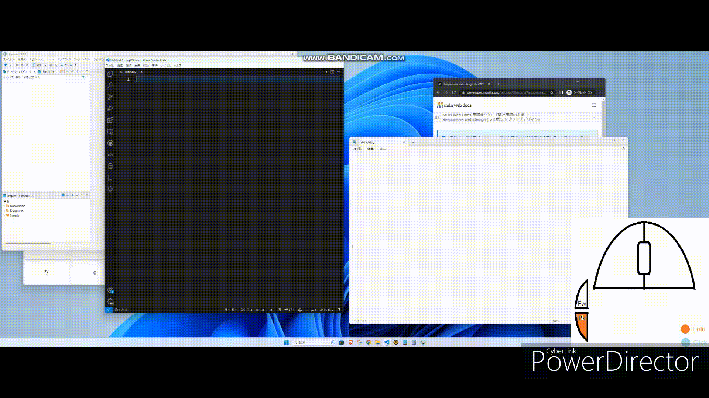
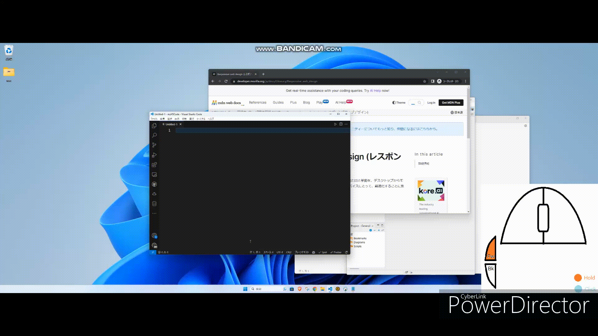

# How to Use

This application is a powerful mouse-based alternative to AltTab, enabling easy snapping of windows to the left or right.

## Demo

| Control | With Back Button | With Forward Button |
|---|---|---|
| Wheel | Adjust window ratio | Select window |
| Left-click | Snap left | Snap selected window left |
| Right-click | Snap right | Snap selected window right |
| Middle-click (default) | Swap left-right windows | Close selected window |
| Middle-click (other options) | Maximize, minimize, or close window under cursor | Maximize, minimize, or close selected window |

## Configuration
Right-click the blue monitor icon in the task tray for settings and to exit.

### Performance Note
Apps like Explorer, video editors, and games may slow when resizing windows. A warning sound may play when memory is low.

# Known Issues

- Rarely, the Forward/Back button may stick when repeatedly adjusting the window ratio. Pressing the stuck button fixes it.

- Some windows may stay visible in the overview after closing, such as the default Windows mail app.

- Clicks may become unresponsive, a bug from previous versions. Press Ctrl+Alt+Delete to resolve.

# Note
While the application is running, it substitutes the mouse's Forward and Back buttons with the Browser Back and Forward functions of the keyboard. These buttons will work as intended when pressed alone. However, in VSCode, these functions might not work as expected. In this case, please change the Go Forward and Go Back shortcuts in VSCode to Browser Back and Browser Forward.
